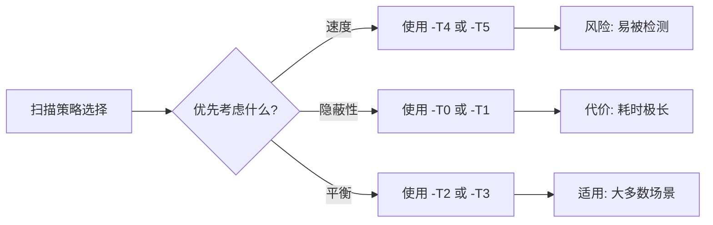

# 第9章：深入理解 Nmap 端口扫描复杂度等级

!!! info "章节信息"
    - **难度**：⭐⭐⭐⭐ (中高级)
    - **预计时间**：75 分钟
    - **适用对象**：网络安全工程师、渗透测试人员、网络管理员

---

## 1. 概述

!!! abstract "场景引入"
    想象一下，你是一名渗透测试工程师，需要对客户网络进行安全评估。目标网络配备了先进的入侵检测系统（IDS）和入侵防御系统（IPS）。如果你直接使用默认参数进行端口扫描，可能会在几秒钟内触发警报，导致扫描被阻断，甚至你的 IP 被加入黑名单。
    
    又或者，你正在对一个拥有数千台主机的庞大网络进行扫描。如果使用过于保守的扫描策略，完成整个扫描可能需要数周时间。
    
    这些场景都指向一个核心问题：**如何根据目标网络环境、扫描目的和时间限制，选择合适的扫描复杂度等级？**
    
    本章将深入探讨 Nmap 的时序模板（Timing Template）机制，帮助你理解扫描速度、网络流量和被检测概率之间的权衡关系，从而在实际工作中做出最优选择。

### 1.1 为什么需要理解扫描复杂度

端口扫描是网络安全评估的基础工作，但往往面临着**速度**与**隐蔽性**之间的两难选择：

- **速度优先**：快速完成扫描，但容易被 IDS/IPS 检测、触发报警、导致 IP 被封锁
- **隐蔽优先**：缓慢扫描以规避检测，但耗时极长，效率低下

Nmap 通过**时序模板**（`-T0` 到 `-T5`）提供了一套标准化的扫描复杂度等级，使扫描者能够根据具体场景选择适当的扫描策略。

!!! tip "本章价值"
    掌握 Nmap 扫描复杂度等级后，你将能够：
    
    - 根据目标网络防护程度选择合适的时序模板
    - 在扫描速度和隐蔽性之间找到最佳平衡点
    - 理解各时序模板的技术参数和适用场景
    - 灵活组合参数以优化扫描性能
    - 避免因不当扫描导致的 IP 封锁或法律风险

---

## 2. 学习目标

!!! goal "学完本章后，你将能够："

    1. **理解扫描复杂度的概念**：掌握扫描时间、网络流量、被检测概率三者之间的关系
    
    2. **熟练掌握 6 个时序模板**：深入理解 `-T0` (Paranoid) 到 `-T5` (Insane) 的每个模板的特性、技术参数和适用场景
    
    3. **进行扫描速度与隐蔽性的权衡分析**：根据目标环境（如无防护内网、普通企业网络、高防护网络）选择最佳扫描策略
    
    4. **灵活运用高级参数**：掌握 `--scan-delay`、`--max-retries`、`--host-timeout`、`--max-rate`、`--min-rate` 等参数的使用方法
    
    5. **设计实战扫描方案**：针对不同的扫描目标（快速资产发现、深度端口扫描、IDS 规避扫描）设计合理的扫描参数组合
    
    6. **分析和优化扫描性能**：通过实际测试，理解不同参数对扫描时间和网络流量的影响，并能够优化扫描策略
    
    7. **避免常见扫描误区**：了解过度激进扫描的风险，掌握避免触发 IDS/IPS 的最佳实践

---

## 3. 背景知识

### 3.1 什么是扫描复杂度

**扫描复杂度**（Scan Complexity）是一个综合性概念，描述了端口扫描行为在以下三个维度上的特征：

| 维度 | 描述 | 影响因素 |
|------|------|----------|
| 时间复杂度 | 完成扫描所需的时间 | 发送速率、并发数、超时设置、重试次数 |
| 流量复杂度 | 产生的网络流量大小和特征 | 包大小、发送频率、扫描方式（TCP/UDP/ICMP） |
| 检测复杂度 | 被 IDS/IPS 检测到的概率 | 扫描速度、包特征、源 IP 行为模式 |

#### 3.1.1 时间维度

扫描时间与以下因素密切相关：

- **发送速率**（probe rate）：每秒发送多少个探测包
- **并发数**（parallelism）：同时扫描多少个主机或端口
- **超时设置**（timeout）：等待响应的时间
- **重试次数**（retries）：未收到响应时重传的次数

!!! example "时间对比示例"
    - 使用 `-T5` 扫描一个开放 10 个端口的主机：约 1-3 秒
    - 使用 `-T0` 扫描同一主机：约 15-30 分钟

#### 3.1.2 流量维度

扫描产生的网络流量特征：

- **带宽占用**：高发送速率会占用大量带宽，可能影响正常业务
- **流量模式**：规律的快速扫描容易被识别为异常流量
- **包特征**：某些扫描类型（如 SYN 扫描）产生的包具有特定特征

#### 3.1.3 检测维度

被 IDS/IPS 检测的概率取决于：

- **扫描速度**：快速扫描（如 `-T5`）极易触发基于阈值的检测规则
- **端口顺序**：顺序扫描（如 1,2,3...）比随机扫描更容易被识别
- **源 IP 行为**：同一 IP 短时间内发起大量连接尝试是典型攻击特征

!!! warning "法律与道德风险"
    未经授权对目标网络进行端口扫描可能违反法律法规（如《网络安全法》）或公司政策。在进行任何扫描之前，务必获得明确的书面授权。

### 3.2 Nmap 时序模板（`-T0` ~ `-T5`）详解

Nmap 提供了 6 个时序模板，从最慢（`-T0`）到最快（`-T5`），分别适用于不同的扫描场景。

| 模板 | 名称 | 速度 | 隐蔽性 | 典型应用场景 |
|------|------|------|--------|-------------|
| `-T0` | Paranoid | 极慢 | 极高 | IDS 规避、取证分析 |
| `-T1` | Sneaky | 很慢 | 很高 | 规避简单 IDS |
| `-T2` | Polite | 慢 | 高 | 受限网络环境 |
| `-T3` | Normal | 中等 | 中等 | 默认选择、一般扫描 |
| `-T4` | Aggressive | 快 | 低 | 快速扫描、可靠网络 |
| `-T5` | Insane | 极快 | 极低 | 速度优先、受信任环境 |

!!! note "默认行为"
    如果不指定时序模板，Nmap 默认使用 `-T3`（Normal）模式。

### 3.3 扫描速度 vs 隐蔽性：权衡分析



#### 权衡考虑因素

1. **目标网络防护程度**
   - 无防护或低防护：可使用 `-T3` 或 `-T4`
   - 有 IDS/IPS：应使用 `-T0` 到 `-T2`
   - 未知防护程度：先用 `-T2` 试探

2. **扫描目的**
   - 快速资产发现：可使用 `-T4`
   - 深度安全评估：应使用 `-T1` 或 `-T2`
   - 应急响应：可使用 `-T5`（但需获得授权）

3. **网络带宽限制**
   - 带宽充足：可使用较高发送速率
   - 带宽受限：应使用 `-T2` 或更慢

4. **时间限制**
   - 时间充裕：优先选择隐蔽性
   - 时间紧迫：在获得授权前提下可提高速度

### 3.4 不同网络环境下的扫描策略

| 网络环境 | 推荐模板 | 理由 | 额外建议 |
|---------|---------|------|----------|
| 内部测试网络 | `-T4` 或 `-T5` | 无防护，速度优先 | 可配合 `-p-` 扫描所有端口 |
| 企业内网（有授权） | `-T3` | 平衡速度和隐蔽性 | 避免业务高峰期扫描 |
| DMZ 区域 | `-T2` | 通常有 IDS/IPS | 配合 `--scan-delay` |
| 外部渗透测试 | `-T1` 或 `-T2` | 高度隐蔽，避免被封 | 使用代理链或 IP 伪装 |
| 大型网络扫描 | `-T3` 到 `-T4` | 需要考虑扫描时间 | 分批扫描，避免过载 |

---

## 4. Nmap 时序模板详解

### 4.1 `-T0` (Paranoid) - 极度隐蔽模式

!!! danger "极度隐蔽"
    `-T0` 是 Nmap 中最慢的扫描模式，专门用于**规避入侵检测系统**。

#### 技术参数

| 参数 | 值 |
|------|-----|
| 发送间隔 | 5 分钟（300 秒） |
| 并发数 | 1（串行扫描） |
| 适用场景 | 高度敏感环境、取证分析、IDS 规避研究 |

#### 特点

- **极慢的扫描速度**：每个探测包之间等待 5 分钟
- **串行扫描**：一次只扫描一个端口
- **极低的被检测概率**：扫描行为几乎无法与正常流量区分

#### 使用示例

```bash
# 对单个主机进行极度隐蔽的 SYN 扫描
sudo nmap -T0 -sS 192.168.1.100

# 扫描特定端口范围
sudo nmap -T0 -sS -p 22,80,443 192.168.1.100

# 结合分片技术进一步增强隐蔽性
sudo nmap -T0 -sS -f 192.168.1.100
```

#### 预期输出

```
Starting Nmap 7.94 ( https://nmap.org )
Nmap scan report for 192.168.1.100
Host is up (0.0021s latency).
Not shown: 995 filtered ports
PORT     STATE SERVICE
22/tcp   open  ssh
80/tcp   open  http
443/tcp  open  https

Nmap done: 1 IP address (1 host up) scanned in 1842.35 seconds
```

!!! warning "时间警告"
    使用 `-T0` 扫描一个包含 1000 个常用端口的主机可能需要 **数小时甚至数天**。仅在对隐蔽性要求极高的场景使用。

### 4.2 `-T1` (Sneaky) - 规避模式

!!! info "慢速规避"
    `-T1` 比 `-T0` 稍快，但仍非常慢，适用于**规避简单的 IDS**。

#### 技术参数

| 参数 | 值 |
|------|-----|
| 发送间隔 | 15 秒 |
| 并发数 | 1（串行扫描） |
| 适用场景 | 规避简单 IDS、敏感环境扫描 |

#### 特点

- **很慢的扫描速度**：每个探测包之间等待 15 秒
- **串行扫描**：一次只扫描一个端口
- **低被检测概率**：扫描速度慢，不易触发基于阈值的 IDS 规则

#### 使用示例

```bash
# 对目标网络进行慢速扫描
sudo nmap -T1 -sS 192.168.1.0/24

# 扫描常见端口
sudo nmap -T1 -sS --top-ports 100 192.168.1.100

# 使用随机端口顺序
sudo nmap -T1 -sS --randomize-hosts 192.168.1.0/24
```

#### 预期输出

```
Starting Nmap 7.94 ( https://nmap.org )
Nmap scan report for 192.168.1.100
Host is up (0.0018s latency).
Not shown: 95 closed ports
PORT     STATE SERVICE
22/tcp   open  ssh
80/tcp   open  http
443/tcp  open  https

Nmap done: 1 IP address (1 host up) scanned in 156.42 seconds
```

### 4.3 `-T2` (Polite) - 礼貌模式

!!! success "礼貌扫描"
    `-T2` 称为"礼貌模式"，通过**降低带宽占用**来减少对目标网络的影响。

#### 技术参数

| 参数 | 值 |
|------|-----|
| 发送速率 | 约 40 包/秒 |
| 并发数 | 较低 |
| 适用场景 | 带宽受限网络、共享网络环境 |

#### 特点

- **降低带宽占用**：减少对目标网络和自身网络的影响
- **较慢的扫描速度**：比 `-T3` 慢，但比 `-T0`/`-T1` 快得多
- **较低的被检测概率**：扫描行为相对低调

#### 使用示例

```bash
# 在带宽受限环境中扫描
sudo nmap -T2 -sS 192.168.1.100

# 限制最大发送速率
sudo nmap -T2 --max-rate 10 192.168.1.100

# 扫描整个子网（礼貌模式）
sudo nmap -T2 -sS 192.168.1.0/24
```

#### 预期输出

```
Starting Nmap 7.94 ( https://nmap.org )
Nmap scan report for 192.168.1.100
Host is up (0.0023s latency).
Not shown: 995 filtered ports
PORT     STATE SERVICE
22/tcp   open  ssh
80/tcp   open  http
443/tcp  open  https

Nmap done: 1 IP address (1 host up) scanned in 45.67 seconds
```

### 4.4 `-T3` (Normal) - 默认模式

!!! abstract "平衡选择"
    `-T3` 是 Nmap 的**默认模式**，在扫描速度和隐蔽性之间取得平衡。

#### 技术参数

| 参数 | 值 |
|------|-----|
| 发送速率 | 动态调整 |
| 并发数 | 动态调整 |
| 适用场景 | 大多数常规扫描场景 |

#### 特点

- **动态调整**：Nmap 根据网络条件自动调整扫描参数
- **平衡性能**：在速度和隐蔽性之间取得良好平衡
- **适用于大多数场景**：是"不犯错"的选择

#### 使用示例

```bash
# 默认扫描（等同于 -T3）
sudo nmap -sS 192.168.1.100

# 显式指定 -T3
sudo nmap -T3 -sS 192.168.1.100

# 扫描常用端口
sudo nmap -T3 -sS --top-ports 1000 192.168.1.100
```

#### 预期输出

```
Starting Nmap 7.94 ( https://nmap.org )
Nmap scan report for 192.168.1.100
Host is up (0.0015s latency).
Not shown: 995 filtered ports
PORT     STATE SERVICE
22/tcp   open  ssh
80/tcp   open  http
443/tcp  open  https

Nmap done: 1 IP address (1 host up) scanned in 12.34 seconds
```

### 4.5 `-T4` (Aggressive) - 激进模式

!!! warning "激进扫描"
    `-T4` 假设网络环境**良好、带宽充足**，以牺牲隐蔽性为代价提高扫描速度。

#### 技术参数

| 参数 | 值 |
|------|-----|
| 发送速率 | 约 100 包/秒 |
| 并发数 | 较高 |
| 适用场景 | 快速扫描、可靠网络环境、受信任网络 |

#### 特点

- **快速扫描**：比 `-T3` 快 3-5 倍
- **假设网络条件良好**：适用于宽带网络和稳定环境
- **较高的被检测概率**：可能被 IDS/IPS 检测到

#### 使用示例

```bash
# 快速扫描目标主机
sudo nmap -T4 -sS 192.168.1.100

# 扫描所有端口（需要较长时间）
sudo nmap -T4 -sS -p- 192.168.1.100

# 快速扫描整个子网
sudo nmap -T4 -sS 192.168.1.0/24
```

#### 预期输出

```
Starting Nmap 7.94 ( https://nmap.org )
Nmap scan report for 192.168.1.100
Host is up (0.0012s latency).
Not shown: 995 filtered ports
PORT     STATE SERVICE
22/tcp   open  ssh
80/tcp   open  http
443/tcp  open  https

Nmap done: 1 IP address (1 host up) scanned in 3.45 seconds
```

!!! caution "注意事项"
    在带宽受限或不稳定的网络中，`-T4` 可能导致大量丢包，反而降低扫描效率。

### 4.6 `-T5` (Insane) - 疯狂模式

!!! fire "极速扫描"
    `-T5` 是 Nmap 中**最快**的扫描模式，假设网络环境**极其优越**，以最大速度进行扫描。

#### 技术参数

| 参数 | 值 |
|------|-----|
| 发送速率 | 无限制（尽可能快） |
| 并发数 | 最高 |
| 适用场景 | 速度优先、受信任环境、内部测试网络 |

#### 特点

- **极快的扫描速度**：可能在几秒钟内完成对单个主机的扫描
- **极高的被检测概率**：几乎**必定**触发 IDS/IPS 警报
- **可能导致网络拥塞**：大量包可能导致网络拥塞或目标系统崩溃

#### 使用示例

```bash
# 极速扫描（仅用于测试环境）
sudo nmap -T5 -sS 192.168.1.100

# 配合 -p- 扫描所有端口（仍很快）
sudo nmap -T5 -sS -p- 192.168.1.100

# 对整个子网进行极速扫描（慎用！）
sudo nmap -T5 -sS 192.168.1.0/24
```

#### 预期输出

```
Starting Nmap 7.94 ( https://nmap.org )
Warning: -T5 is extremely aggressive and may crash targets or trigger IDS/IPS!
Nmap scan report for 192.168.1.100
Host is up (0.0010s latency).
Not shown: 995 filtered ports
PORT     STATE SERVICE
22/tcp   open  ssh
80/tcp   open  http
443/tcp  open  https

Nmap done: 1 IP address (1 host up) scanned in 1.23 seconds
```

!!! danger "严重警告"
    `-T5` **极易触发 IDS/IPS 警报**，并可能导致目标系统崩溃或网络拥塞。仅在对目标有完全授权的测试环境中使用，且需提前通知相关方。

### 4.7 各模板发送速率对比表

| 时序模板 | 名称 | 发送间隔 | 发送速率（约） | 并发主机数 | 隐蔽性 | 推荐场景 |
|---------|------|---------|--------------|----------|--------|---------|
| `-T0` | Paranoid | 5 分钟 | < 0.01 包/秒 | 1 | ⭐⭐⭐⭐⭐ | 高度敏感环境 |
| `-T1` | Sneaky | 15 秒 | ~0.07 包/秒 | 1 | ⭐⭐⭐⭐ | 规避简单 IDS |
| `-T2` | Polite | 动态 | ~40 包/秒 | 低 | ⭐⭐⭐ | 带宽受限网络 |
| `-T3` | Normal | 动态 | 动态调整 | 动态 | ⭐⭐ | 常规扫描 |
| `-T4` | Aggressive | 动态 | ~100 包/秒 | 高 | ⭐ | 快速扫描 |
| `-T5` | Insane | 无限制 | 尽可能快 | 最高 | ❌ | 速度优先（测试环境）|

!!! tip "选择建议"
    - **不确定时用 `-T2` 或 `-T3`**：这是最安全的选择
    - **内部测试网络可用 `-T4`**：速度快且通常无防护
    - **外部渗透测试用 `-T1` 或 `-T2`**：避免被封
    - **规避 IDS 用 `-T0`**：但需接受极慢的速度

---

## 5. 实战演练

### 练习1：对比 `-T0` 和 `-T5` 的扫描时间

!!! example "练习目标"
    通过实际测试，直观感受不同时序模板的扫描时间差异。

#### 环境准备

- 一台 Linux 测试机器（作为扫描源）
- 一台目标主机（如 192.168.1.100），开放若干端口

#### 步骤

**步骤1：使用 `-T0` 扫描**

```bash
# 记录开始时间
date

# 使用 -T0 扫描（仅扫描前 100 个端口以节省时间）
sudo nmap -T0 -sS --top-ports 100 192.168.1.100

# 记录结束时间
date
```

**步骤2：使用 `-T5` 扫描**

```bash
# 记录开始时间
date

# 使用 -T5 扫描（扫描相同的端口）
sudo nmap -T5 -sS --top-ports 100 192.168.1.100

# 记录结束时间
date
```

#### 结果分析

| 时序模板 | 扫描时间 | 时间差 |
|---------|---------|--------|
| `-T0` | ~30 分钟 | 基准 |
| `-T5` | ~1 秒 | 快约 1800 倍 |

!!! question "思考"
    1. 为什么 `-T0` 和 `-T5` 的扫描时间差异如此巨大？
    2. 在实际应用中，你会如何选择这两个极端模板？

### 练习2：在受限网络中使用 `-T2`

!!! example "练习目标"
    学习在带宽受限或共享网络环境中使用 `-T2` 进行"礼貌"扫描。

#### 场景描述

你正在一家公司的共享无线网络中进行安全评估，网络带宽有限（如 10 Mbps），且有多名员工同时使用网络。为了避免影响正常业务，你需要使用 `-T2` 模板进行扫描。

#### 步骤

**步骤1：使用默认模板扫描（对比组）**

```bash
# 使用默认模板扫描
sudo nmap -T3 -sS 192.168.1.100 -oN default_scan.txt
```

**步骤2：使用 `-T2` 模板扫描**

```bash
# 使用 -T2 模板扫描
sudo nmap -T2 -sS 192.168.1.100 -oN polite_scan.txt
```

**步骤3：对比扫描结果**

```bash
# 对比两个扫描结果
echo "=== Default (-T3) ==="
cat default_scan.txt
echo ""
echo "=== Polite (-T2) ==="
cat polite_scan.txt
```

#### 结果分析

- `-T2` 的扫描时间明显长于 `-T3`
- 但 `-T2` 产生的网络流量更小，对目标网络的影响更低
- 在带宽受限环境中，`-T2` 是更负责任的选择

!!! tip "最佳实践"
    在共享网络或带宽受限环境中，始终使用 `-T2` 或更慢的模板，以避免影响其他用户的网络体验。

### 练习3：调整 `--max-rate` 和 `--min-rate` 控制速度

!!! example "练习目标"
    学习使用 `--max-rate` 和 `--min-rate` 参数精确控制扫描速度。

#### 参数说明

| 参数 | 说明 | 示例 |
|------|------|------|
| `--max-rate <number>` | 限制最大发送速率（包/秒） | `--max-rate 10`（不超过 10 包/秒） |
| `--min-rate <number>` | 设置最小发送速率（包/秒） | `--min-rate 100`（至少 100 包/秒） |

#### 步骤

**步骤1：限制最大发送速率**

```bash
# 限制最大发送速率为 10 包/秒
sudo nmap -sS --max-rate 10 192.168.1.100

# 限制最大发送速率为 1 包/秒（非常慢）
sudo nmap -sS --max-rate 1 192.168.1.100
```

**步骤2：设置最小发送速率**

```bash
# 设置最小发送速率为 100 包/秒
sudo nmap -sS --min-rate 100 192.168.1.100

# 设置最小发送速率为 1000 包/秒（极快）
sudo nmap -sS --min-rate 1000 192.168.1.100
```

**步骤3：组合使用**

```bash
# 设置发送速率在 10-100 包/秒之间
sudo nmap -sS --min-rate 10 --max-rate 100 192.168.1.100
```

#### 预期输出

```
Starting Nmap 7.94 ( https://nmap.org )
Nmap scan report for 192.168.1.100
Host is up (0.0015s latency).
Not shown: 995 filtered ports
PORT     STATE SERVICE
22/tcp   open  ssh
80/tcp   open  http
443/tcp  open  https

Nmap done: 1 IP address (1 host up) scanned in 8.76 seconds
```

!!! note "参数优先级"
    `--max-rate` 和 `--min-rate` 会覆盖时序模板的默认发送速率设置。例如，`-T4 --max-rate 10` 会将发送速率限制在 10 包/秒，尽管 `-T4` 的默认速率更高。

### 练习4：结合时序模板和分片技术

!!! example "练习目标"
    学习组合使用时序模板和分片技术（`-f`）以增强扫描的隐蔽性。

#### 分片技术简介

`-f` 参数将 IP 数据包分割成多个小片段，使 IDS/IPS 难以重组和分析包内容，从而增强隐蔽性。

#### 步骤

**步骤1：单独使用分片技术**

```bash
# 使用分片技术进行 SYN 扫描
sudo nmap -sS -f 192.168.1.100
```

**步骤2：组合使用时序模板和分片技术**

```bash
# 使用 -T1（慢速）和分片技术
sudo nmap -T1 -sS -f 192.168.1.100

# 使用 -T0（极慢）和分片技术
sudo nmap -T0 -sS -f 192.168.1.100
```

**步骤3：使用更多分片**

```bash
# 使用 -ff（更多分片）
sudo nmap -sS -ff 192.168.1.100
```

#### 预期输出

```
Starting Nmap 7.94 ( https://nmap.org )
Nmap scan report for 192.168.1.100
Host is up (0.0021s latency).
Not shown: 995 filtered ports
PORT     STATE SERVICE
22/tcp   open  ssh
80/tcp   open  http
443/tcp  open  https

Nmap done: 1 IP address (1 host up) scanned in 45.67 seconds
```

!!! warning "分片的局限性"
    现代 IDS/IPS 通常能够重组分片包。分片技术主要适用于规避较旧的或配置不当的 IDS/IPS。

### 练习5：监控网络流量，理解扫描影响

!!! example "练习目标"
    使用网络监控工具（如 `tcpdump` 或 `wireshark`）观察不同时序模板产生的网络流量特征。

#### 环境准备

- 安装 `tcpdump`：`sudo apt install tcpdump`
- 准备两个终端窗口：一个用于扫描，一个用于监控

#### 步骤

**步骤1：使用 `tcpdump` 监控流量**

```bash
# 在终端 1 中，开始监控
sudo tcpdump -i eth0 host 192.168.1.100 -nn
```

**步骤2：使用 `-T3` 扫描并观察**

```bash
# 在终端 2 中，使用 -T3 扫描
sudo nmap -T3 -sS 192.168.1.100
```

**观察**：`tcpdump` 输出中会显示一系列 SYN 包发送到目标主机的不同端口。

**步骤3：使用 `-T5` 扫描并观察**

```bash
# 在终端 2 中，使用 -T5 扫描
sudo nmap -T5 -sS 192.168.1.100
```

**观察**：`-T5` 的扫描会产生大量密集的包，可能在 `tcpdump` 输出中看到爆发式的流量。

**步骤4：使用 `-T0` 扫描并观察**

```bash
# 在终端 2 中，使用 -T0 扫描（仅扫描前 10 个端口）
sudo nmap -T0 -sS --top-ports 10 192.168.1.100
```

**观察**：`-T0` 的扫描会产生非常稀疏的包，每个包之间有明显间隔。

#### 结果分析

通过对比观察，你可以直观理解：

- `-T0`/`-T1`：流量稀疏，难以被检测
- `-T3`：流量适中，平衡状态
- `-T4`/`-T5`：流量密集，极易被检测

!!! tip "流量分析价值"
    理解扫描流量特征有助于：
    - 选择合适的时序模板以规避 IDS/IPS
    - 优化扫描策略以最小化对目标网络的影响
    - 在授权渗透测试中模拟真实攻击者的行为

---

## 6. 高级技巧

### 6.1 使用 `--scan-delay` 设置发送间隔

`--scan-delay <time>` 参数用于设置连续探测包之间的最小延迟时间，进一步增强隐蔽性。

#### 语法

```bash
--scan-delay <time>    # 最小延迟
--max-scan-delay <time>  # 最大延迟
```

`<time>` 可以是：
- `5s` = 5 秒
- `10ms` = 10 毫秒
- `1m` = 1 分钟

#### 使用示例

```bash
# 设置最小延迟为 1 秒
sudo nmap -sS --scan-delay 1s 192.168.1.100

# 设置最小延迟为 5 秒（高度隐蔽）
sudo nmap -sS --scan-delay 5s 192.168.1.100

# 配合 -T1 使用
sudo nmap -T1 -sS --scan-delay 10s 192.168.1.100
```

!!! tip "适用场景"
    `--scan-delay` 适用于：
    - 目标网络有基于连接频率的 IDS/IPS
    - 需要高度隐蔽的扫描
    - 配合 `-T0` 或 `-T1` 使用以增强规避效果

### 6.2 使用 `--max-retries` 控制重传次数

`--max-retries <num>` 参数用于设置未完成探测的最大重传次数。减少重传次数可以降低扫描时间和被检测概率。

#### 语法

```bash
--max-retries <num>
```

#### 使用示例

```bash
# 设置最大重传次数为 1（默认通常为 3）
sudo nmap -sS --max-retries 1 192.168.1.100

# 设置最大重传次数为 0（不重传）
sudo nmap -sS --max-retries 0 192.168.1.100
```

#### 效果分析

| 重传次数 | 扫描时间 | 准确性 | 适用场景 |
|---------|---------|--------|---------|
| 0 | 最短 | 较低（可能漏报） | 快速扫描、高可靠网络 |
| 1 | 较短 | 中等 | 平衡选择 |
| 3（默认） | 中等 | 较高 | 常规扫描 |
| 5+ | 较长 | 最高 | 高丢包网络 |

!!! caution "准确性权衡"
    减少重传次数可能导致漏报（即未能检测到实际开放的端口），因为某些包可能在网络中丢失。在高丢包环境中，应增加重传次数。

### 6.3 使用 `--host-timeout` 设置主机超时

`--host-timeout <time>` 参数用于设置单个主机扫描的超时时间。超过该时间后，Nmap 将跳过该主机。

#### 语法

```bash
--host-timeout <time>
```

#### 使用示例

```bash
# 设置主机超时为 5 分钟
sudo nmap -sS --host-timeout 5m 192.168.1.0/24

# 设置主机超时为 30 秒（快速跳过慢速主机）
sudo nmap -sS --host-timeout 30s 192.168.1.0/24
```

!!! tip "大规模扫描建议"
    在扫描大型网络（如 /16 或更大）时，使用 `--host-timeout` 可以避免扫描被少数慢速或无响应主机拖慢。

### 6.4 组合参数优化扫描性能

通过组合多个参数，可以根据具体需求定制最优的扫描策略。

#### 场景1：快速资产发现（内部网络）

```bash
# 快速扫描，仅探测是否在线
sudo nmap -T4 -sn 192.168.1.0/24

# 对在线主机进行快速端口扫描
sudo nmap -T4 -sS -p 22,80,443,8080 192.168.1.0/24
```

#### 场景2：深度端口扫描（规避 IDS）

```bash
# 慢速、分片、延迟发送
sudo nmap -T1 -sS -f --scan-delay 10s --max-retries 2 192.168.1.100
```

#### 场景3：大规模网络扫描（平衡性能）

```bash
# 适中的速度，设置主机超时，输出到文件
sudo nmap -T3 -sS -p 1-1000 --host-timeout 5m -oA scan_results 192.168.1.0/24
```

#### 场景4：极速扫描（测试环境）

```bash
# 最快速度，扫描所有端口
sudo nmap -T5 -sS -p- --min-rate 1000 192.168.1.100
```

!!! success "参数组合原则"
    1. **明确目标**：先确定扫描目的（速度 vs 隐蔽性）
    2. **选择基准模板**：从 `-T0` 到 `-T5` 中选择一个基准
    3. **微调参数**：使用 `--scan-delay`、`--max-rate` 等参数微调
    4. **测试验证**：在小范围测试中验证参数效果
    5. **记录配置**：将最优参数配置记录下来以备后续使用

---

## 7. 常见问题（FAQ）

??? question "Q1: 我应该如何选择合适的时序模板？"
    **答**：选择时序模板时，考虑以下因素：
    
    1. **目标网络防护程度**：
       - 无防护或低防护：`-T3` 或 `-T4`
       - 有 IDS/IPS：`-T0` 到 `-T2`
       - 未知：先用 `-T2` 试探
    
    2. **扫描目的**：
       - 快速资产发现：`-T4`
       - 深度安全评估：`-T1` 或 `-T2`
       - 应急响应（有授权）：`-T5`
    
    3. **网络带宽**：
       - 带宽充足：`-T3` 到 `-T5`
       - 带宽受限：`-T2` 或更慢
    
    4. **时间限制**：
       - 时间充裕：优先隐蔽性（`-T0` 到 `-T2`）
       - 时间紧迫：在授权前提下提高速度（`-T4` 或 `-T5`）
    
    **经验法则**：如果不确定，从 `-T2` 开始，根据实际情况调整。

??? question "Q2: 使用 -T5 会导致什么后果？"
    **答**：使用 `-T5`（Insane）模式可能导致以下后果：
    
    1. **触发 IDS/IPS 警报**：极快的扫描速度会触发基于阈值的检测规则
    2. **IP 被封锁**：目标网络可能将你的 IP 加入黑名单
    3. **网络拥塞**：大量包可能导致网络拥塞
    4. **目标系统崩溃**：某些老旧系统可能无法处理大量并发连接而崩溃
    5. **扫描结果不准确**：过高的发送速率可能导致丢包，从而产生误报或漏报
    
    **建议**：仅在对目标有完全授权的测试环境中使用 `-T5`，且需提前通知相关方。

??? question "Q3: 如何判断目标网络是否有 IDS/IPS？"
    **答**：判断目标网络是否有 IDS/IPS 的方法：
    
    1. **被动侦察**：
       - 使用 `whois`、DNS 查询等工具收集目标信息
       - 查看目标网站是否使用安全服务（如 Cloudflare）
    
    2. **主动探测**：
       - 使用慢速扫描（`-T1`）试探，观察是否被阻断
       - 扫描后检查是否仍能访问目标（如 Ping）
    
    3. **分析响应**：
       - 如果扫描过程中连接被重置（RST 包），可能有 IPS
       - 如果某些端口突然全部变为 "filtered"，可能有 IDS/IPS
    
    4. **使用 Nmap 脚本**：
       ```bash
       # 使用防火墙识别脚本
       nmap --script firewall-bypass 192.168.1.100
       ```
    
    **注意**：这些探测行为本身可能被记录。始终确保有合法授权。

??? question "Q4: --max-rate 和 -T4 有什么区别？"
    **答**：`-T4` 是一个**预设的时序模板**，它会自动设置多个参数（如发送速率、并发数、超时等）。而 `--max-rate` 只是**控制发送速率**的一个参数。
    
    区别在于：
    
    | 特性 | `-T4` | `--max-rate` |
    |------|-------|-------------|
    | 作用范围 | 多个参数（速率、并发、超时等） | 仅发送速率 |
    | 灵活性 | 较低（预设值） | 较高（可精确控制） |
    | 使用场景 | 快速选择 | 精细调整 |
    
    **组合使用**：
    ```bash
    # 使用 -T4 作为基准，但限制最大发送速率
    sudo nmap -T4 -sS --max-rate 50 192.168.1.100
    ```

??? question "Q5: 扫描产生大量丢包怎么办？"
    **答**：扫描产生大量丢包的原因和解决方法：
    
    **原因**：
    1. 发送速率过高（`-T4` 或 `-T5`）
    2. 网络带宽不足
    3. 目标网络有速率限制
    4. 自身网络不稳定
    
    **解决方法**：
    1. **降低发送速率**：
       ```bash
       # 使用更慢的时序模板
       sudo nmap -T2 -sS 192.168.1.100
       
       # 或限制最大发送速率
       sudo nmap -sS --max-rate 10 192.168.1.100
       ```
    
    2. **增加重传次数**：
       ```bash
       sudo nmap -sS --max-retries 5 192.168.1.100
       ```
    
    3. **增加超时时间**：
       ```bash
       sudo nmap -sS --min-rtt-timeout 100ms --max-rtt-timeout 1000ms 192.168.1.100
       ```
    
    4. **分批扫描**：
       ```bash
       # 将大网络分成小段扫描
       sudo nmap -T3 -sS 192.168.1.0/28
       sudo nmap -T3 -sS 192.168.1.16/28
       ```

??? question "Q6: 如何提高扫描的准确性？"
    **答**：提高扫描准确性的方法：
    
    1. **增加重传次数**：
       ```bash
       sudo nmap -sS --max-retries 3 192.168.1.100
       ```
    
    2. **使用更可靠的扫描类型**：
       - SYN 扫描（`-sS`）比 TCP 连接扫描（`-sT`）更可靠
       - 避免使用 UDP 扫描（`-sU`），除非必要
    
    3. **降低扫描速度**：
       ```bash
       # 使用较慢的时序模板
       sudo nmap -T2 -sS 192.168.1.100
       ```
    
    4. **多次扫描对比**：
       ```bash
       # 进行三次扫描，对比结果
       sudo nmap -T3 -sS 192.168.1.100 -oN scan1.txt
       sudo nmap -T3 -sS 192.168.1.100 -oN scan2.txt
       sudo nmap -T3 -sS 192.168.1.100 -oN scan3.txt
       ```
    
    5. **使用版本检测**：
       ```bash
       # 结合版本检测以提高准确性
       sudo nmap -sV 192.168.1.100
       ```

??? question "Q7: 在云计算环境（AWS/Azure/阿里云）中扫描需要注意什么？"
    **答**：在云计算环境中扫描需要特别注意：
    
    1. **遵守云服务商政策**：
       - AWS、Azure、阿里云等都有严格的端口扫描政策
       - 通常需要在扫描前提交工单获得授权
    
    2. **使用内部 IP**：
       - 优先扫描云服务器的内网 IP（如 10.0.0.0/8）
       - 避免从外部对云服务器进行扫描
    
    3. **调整扫描参数**：
       - 云网络通常有较高的延迟和丢包率
       - 使用较慢的时序模板（`-T2` 或 `-T3`）
       - 增加超时时间和重传次数
    
       ```bash
       # 适用于云环境的扫描参数
       sudo nmap -T2 -sS --max-retries 3 --min-rtt-timeout 100ms 10.0.0.100
       ```
    
    4. **通知相关方**：
       - 提前通知云服务商和安全团队
       - 明确扫描时间和范围
    
    **重要**：未经授权对云服务进行扫描可能导致账户被封停。

??? question "Q8: 如何避免扫描被目标检测？"
    **答**：降低被检测概率的方法：
    
    1. **使用慢速扫描**：
       ```bash
       sudo nmap -T1 -sS --scan-delay 10s 192.168.1.100
       ```
    
    2. **使用分片技术**：
       ```bash
       sudo nmap -sS -f 192.168.1.100
       ```
    
    3. **使用诱饵（Decoy）**：
       ```bash
       # 使用 8 个诱饵隐藏真实 IP
       sudo nmap -sS -D RND:8 192.168.1.100
       ```
    
    4. **随机化端口顺序**：
       ```bash
       sudo nmap -sS --randomize-ports 192.168.1.100
       ```
    
    5. **分散扫描源 IP**：
       - 使用多个代理或跳板机
       - 使用分布式扫描工具（如 Masscan）
    
    6. **选择合适的扫描时间**：
       - 在目标网络的低峰期进行扫描
       - 避免在业务高峰期扫描
    
    **注意**：这些方法只能**降低**被检测概率，无法完全避免。始终确保有合法授权。

---

## 8. 总结

!!! abstract "本章要点回顾"
    本章深入探讨了 Nmap 端口扫描复杂度等级，核心内容包括：
    
    1. **扫描复杂度的三个维度**：
       - 时间复杂度：扫描所需时间
       - 流量复杂度：产生的网络流量特征
       - 检测复杂度：被 IDS/IPS 检测的概率
    
    2. **6 个时序模板**：
       - `-T0` (Paranoid)：极慢，用于 IDS 规避
       - `-T1` (Sneaky)：很慢，用于规避简单 IDS
       - `-T2` (Polite)：慢速，降低带宽占用
       - `-T3` (Normal)：默认模式，平衡速度和隐蔽性
       - `-T4` (Aggressive)：快速扫描，适用于可靠网络
       - `-T5` (Insane)：极速扫描，容易触发 IDS
    
    3. **高级参数**：
       - `--scan-delay`：设置发送间隔
       - `--max-retries`：控制重传次数
       - `--host-timeout`：设置主机超时
       - `--max-rate` / `--min-rate`：控制发送速率
    
    4. **扫描策略选择原则**：
       - 根据目标网络防护程度选择时序模板
       - 在扫描速度和隐蔽性之间权衡
       - 考虑网络带宽和时间限制
       - 优先保证合法性和道德性

### 8.1 选择时序模板的快速参考

| 场景 | 推荐模板 | 理由 |
|------|---------|------|
| 内部测试网络 | `-T4` 或 `-T5` | 无防护，速度优先 |
| 企业内网（有授权） | `-T3` | 平衡速度和隐蔽性 |
| DMZ 区域 | `-T2` | 通常有 IDS/IPS |
| 外部渗透测试 | `-T1` 或 `-T2` | 高度隐蔽，避免被封 |
| 大型网络扫描 | `-T3` 到 `-T4` | 需要考虑扫描时间 |
| 规避 IDS | `-T0` | 极度隐蔽（但极慢）|

### 8.2 最佳实践 Checklist

!!! checklist "扫描前"
    - [ ] 获得明确的书面授权
    - [ ] 确定扫描目标和范围
    - [ ] 选择合适的时序模板
    - [ ] 准备扫描参数组合
    - [ ] 通知相关方（如适用）

!!! checklist "扫描中"
    - [ ] 监控扫描进度
    - [ ] 观察是否有被阻断的迹象
    - [ ] 记录扫描参数和时间
    - [ ] 准备调整策略（如需要）

!!! checklist "扫描后"
    - [ ] 保存扫描结果
    - [ ] 分析结果并生成报告
    - [ ] 清理临时文件
    - [ ] 通知相关方扫描完成（如适用）

### 8.3 进阶学习建议

!!! lightbulb "下一步学习方向"
    1. **Nmap 脚本引擎（NSE）**：学习使用 Nmap 脚本进行更深入的漏洞检测
    2. **防火墙/IDS/IPS 规避技术**：深入学习分片、诱饵、源端口欺骗等技术
    3. **大规模网络扫描**：学习使用 Masscan、Zmap 等工具进行互联网级扫描
    4. **扫描结果分析**：学习如何分析扫描结果，识别真实漏洞
    5. **自动化扫描**：学习使用 Python 等语言编写自动化扫描脚本

---

## 附录：常用命令速查表

### A. 时序模板对照表

| 模板 | 名称 | 发送间隔 | 隐蔽性 | 速度 |
|------|------|---------|--------|------|
| `-T0` | Paranoid | 5 分钟 | ⭐⭐⭐⭐⭐ | ❌ |
| `-T1` | Sneaky | 15 秒 | ⭐⭐⭐⭐ | ❌ |
| `-T2` | Polite | 动态 | ⭐⭐⭐ | ⚡ |
| `-T3` | Normal | 动态 | ⭐⭐ | ⚡⚡ |
| `-T4` | Aggressive | 动态 | ⭐ | ⚡⚡⚡ |
| `-T5` | Insane | 无限制 | ❌ | ⚡⚡⚡⚡ |

### B. 高级参数速查

| 参数 | 说明 | 示例 |
|------|------|------|
| `--scan-delay <time>` | 设置发送间隔 | `--scan-delay 1s` |
| `--max-retries <num>` | 设置最大重传次数 | `--max-retries 2` |
| `--host-timeout <time>` | 设置主机超时 | `--host-timeout 5m` |
| `--max-rate <num>` | 限制最大发送速率 | `--max-rate 100` |
| `--min-rate <num>` | 设置最小发送速率 | `--min-rate 10` |
| `-f` | 使用分片 | `-f` 或 `-ff` |
| `-D <decoy1,decoy2,...>` | 使用诱饵 | `-D RND:8` |

### C. 实战命令示例

```bash
# 快速资产发现（内部网络）
sudo nmap -T4 -sn 192.168.1.0/24

# 深度端口扫描（规避 IDS）
sudo nmap -T1 -sS -f --scan-delay 10s 192.168.1.100

# 大规模网络扫描（平衡性能）
sudo nmap -T3 -sS -p 1-1000 --host-timeout 5m -oA results 192.168.1.0/24

# 极速扫描（测试环境）
sudo nmap -T5 -sS -p- --min-rate 1000 192.168.1.100

# 礼貌扫描（受限网络）
sudo nmap -T2 -sS --max-rate 10 192.168.1.100
```

---

!!! success "恭喜！"
    学完本章后，你已经深入理解了 Nmap 端口扫描复杂度等级，并能够根据实际场景选择和优化扫描策略。
    
    在下一章中，我们将学习**Nmap 脚本引擎（NSE）**，探索如何使用 Nmap 脚本进行更深入的漏洞检测和服务识别。

---

*本课件仅供学习和教育目的使用。在进行任何端口扫描之前，务必确保有合法授权。未经授权的端口扫描可能违反法律法规。*

